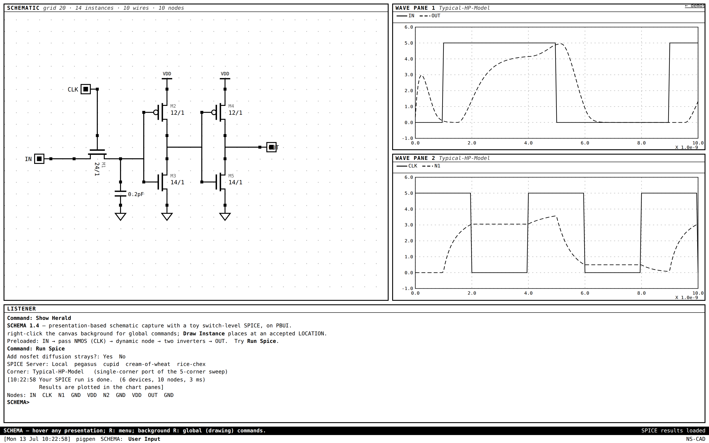
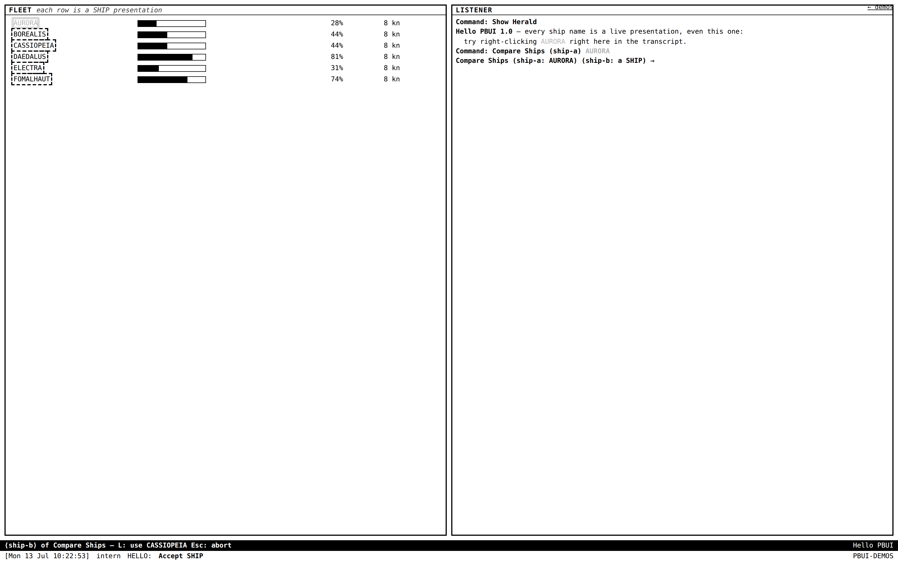
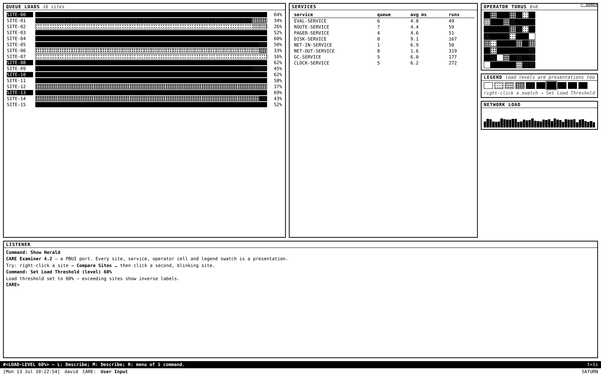
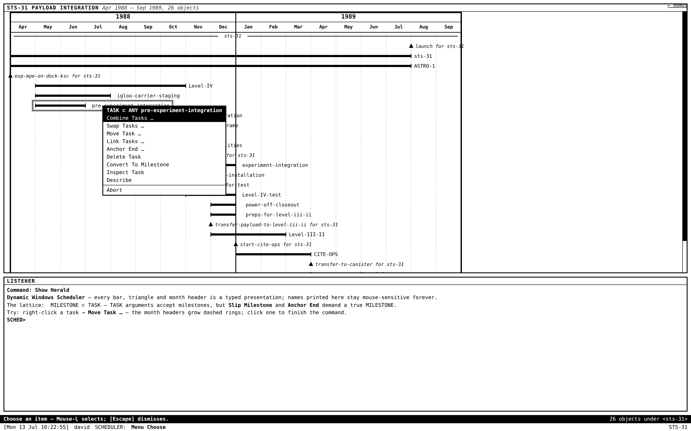
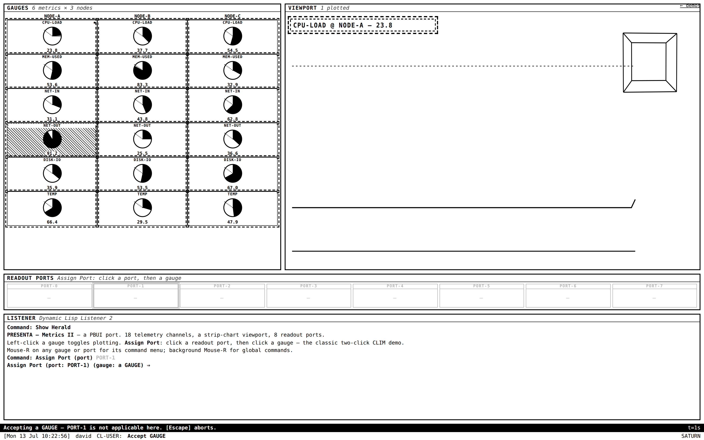
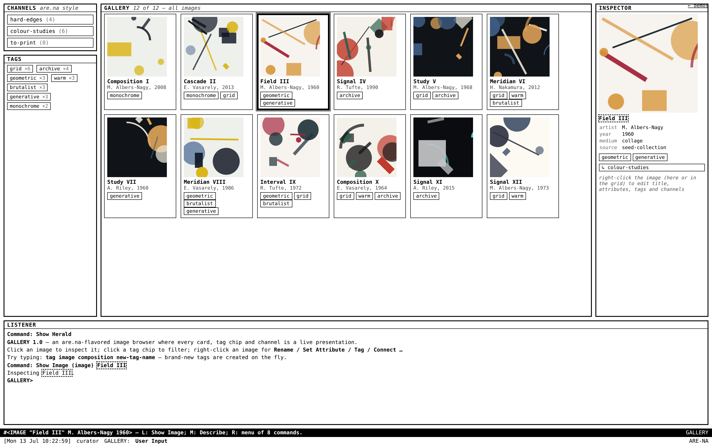
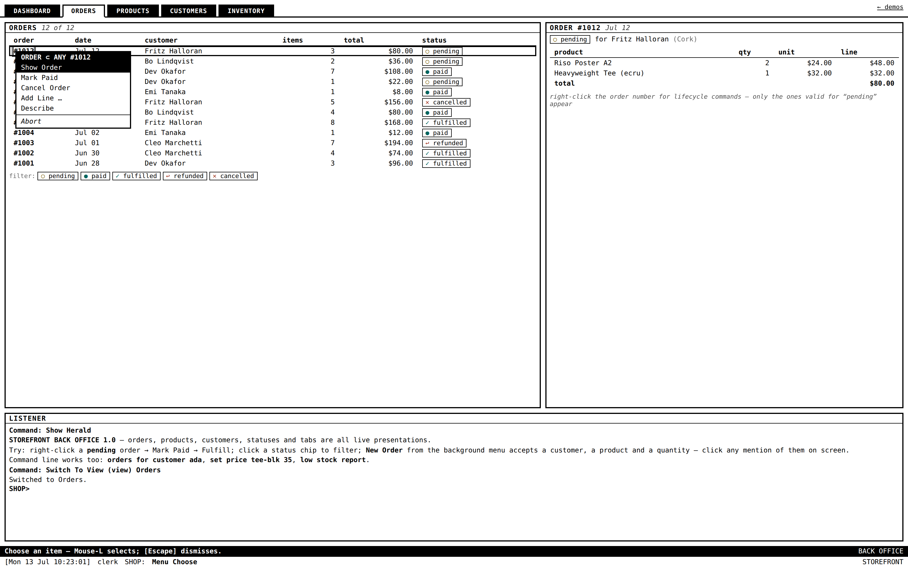
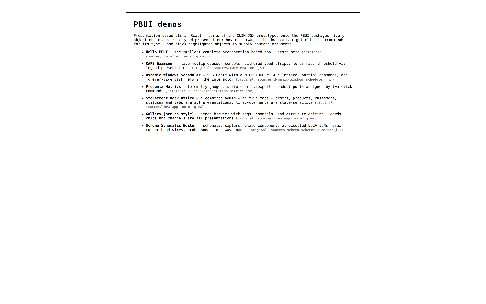

# pbui — presentation-based UIs for TypeScript + React

A CLIM / Genera Dynamic-Windows style interaction model as a set of shared
packages: every object on screen is a *typed presentation* of a domain
object. Hover it and a documentation line tells you what the mouse will do;
right-click it for a menu of exactly the commands applicable to its type;
when a command needs an argument, matching presentations grow marching-ants
outlines and everything else goes inert — click one (or type) to supply it.
Objects printed to the listener transcript remain live presentations
forever.

Grounded in E. C. Ciccarelli's *Presentation Based User Interfaces* (MIT
AITR-794, 1984) and twelve hand-written JSX prototypes preserved in
`sources/`. Full analysis and design doc in the CLIM-JSX-001 ticket under
`ttmp/`.


*The schematic editor after `Run Spice`: waveforms plotted per probed node, and the "Nodes:" line in the listener is made of clickable NODE presentations.*

## Documentation

- [`docs/getting-started.md`](docs/getting-started.md) — build a complete app from an empty file; every concept introduced as you need it.
- [`docs/user-guide.md`](docs/user-guide.md) — the developer reference: the model, each mechanism's purpose and boundaries, how the packages relate, performance and testing.
- [`docs/api-reference.md`](docs/api-reference.md) — every public export, exact signatures and contracts.
- Each package has a README covering its role, a minimal example, and its key exports; `apps/demos/README.md` gives a reading order through the seven example apps.

## Packages

| package | what |
|---|---|
| `@go-go-golems/pbui-core` | framework-free engine: ptype lattice with print/parse codecs, presentation registry (the "presentation data base"), command tables with typed args, accept-loop FSM, coercions, output records, pull-derived pointer doc |
| `@go-go-golems/pbui-react` | `PbuiProvider`, headless `usePresentation`, `<Presentation>` / `<SvgPresentation>`, `usePbuiSurface` |
| `@go-go-golems/pbui-listener` | transcript + morphing prompt line + command line (prefix match, completion) |
| `@go-go-golems/pbui-chrome` | context menus, mouse-doc bar, status line, pane frames |
| `@go-go-golems/pbui-theme-genera` | the monochrome look: `import "@go-go-golems/pbui-theme-genera/genera.css"` |

## Demos

```sh
pnpm install
pnpm demos          # http://localhost:5199
```

Seven demos in `apps/demos`: a tutorial, four ports of the original
prototypes, and two product-shaped applications. `apps/demos/README.md`
gives a reading order; `apps/demos/PORTING-NOTES.md` is the recipe for
writing your own.

| | |
|---|---|
|  **Hello PBUI** — the smallest complete app, caught mid-command: *Compare Ships* is accepting its second SHIP, the eligible ships carry marching-ants outlines, and the doc bar explains the hovered candidate. |  **CARE Examiner** — a live multiprocessor console; dithered queue-load strips keep ticking during input contexts, and the legend swatches are LOAD-LEVEL presentations (a threshold was just set by right-clicking one). |
|  **Dynamic Windows Scheduler** — an SVG Gantt with a real type lattice; the open menu is titled `TASK ⊂ ANY` and every task name ever printed to the interactor stays mouse-sensitive. |  **Presenta Metrics** — the classic two-click flow: a readout port was clicked, so every gauge (including the plotted lane labels in the viewport) is glowing, waiting to be wired. |
|  **Gallery** — an are.na-style image browser; cards, tag chips, and channels are presentations, tags are created on the fly from typed input, and editing runs through the command loop. |  **Storefront Back Office** — a five-tab e-commerce admin; the open lifecycle menu is derived from the order's state, tabs stay usable mid-command, and `undo` restores fulfillments (stock included). |

The launcher at `/` lists them all:



## Develop

```sh
pnpm test        # unit tests: core (53) + react RTL (19)
pnpm typecheck   # strict tsc across the workspace
cd apps/demos && pnpm exec playwright test --project=chromium  # 26 e2e
cd apps/demos && pnpm exec playwright test --project=perf      # render budget
```

CI runs all four (`.github/workflows/ci.yml`). Command authoring uses the
typed builder (`commandBuilder`/`arg.*` — resolved args, central staleness,
`api.snapshotUndo` for undo); the full recipe is in
`apps/demos/PORTING-NOTES.md`. Everything is keyboard-operable: Tab/arrows
move the focus cursor, Enter clicks, `m` opens menus, Tab cycles eligible
presentations during accepts, Up/Down recalls listener input.
