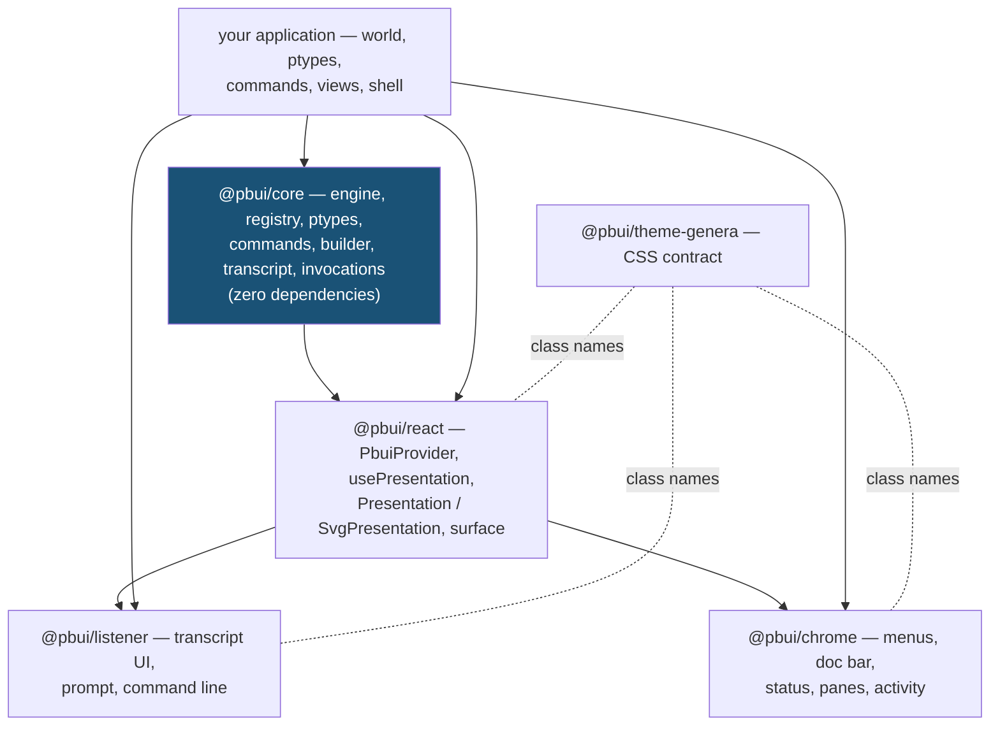

# The @pbui User Guide

This guide is the developer reference for the @pbui packages. Where the Getting Started guide builds an application, this one explains the system underneath it: what each mechanism is for, why it has the shape it has, how the packages relate, and where the boundaries and sharp edges are. Read it before extending an application beyond the tutorial patterns, and consult the API reference (`docs/api-reference.md`) alongside it for exact signatures.

The guide assumes you have built or at least read one application. Chapters are ordered so that each depends only on earlier ones.

## Contents

1. [The model](#1-the-model)
2. [The package map](#2-the-package-map)
3. [The registry: the presentation database](#3-the-registry)
4. [References, resolution, and staleness](#4-references-resolution-and-staleness)
5. [Presentation types](#5-presentation-types)
6. [Commands and the accept loop](#6-commands-and-the-accept-loop)
7. [The typed builder](#7-the-typed-builder)
8. [Output records and the listener](#8-output-records-and-the-listener)
9. [Invocations and undo](#9-invocations-and-undo)
10. [Participation modes](#10-participation-modes)
11. [Keyboard and accessibility](#11-keyboard-and-accessibility)
12. [The performance model](#12-the-performance-model)
13. [Render media: HTML, SVG, canvas](#13-render-media)
14. [Testing your application](#14-testing-your-application)
15. [Extension points and deliberate omissions](#15-extension-points)
16. [Glossary](#16-glossary)

## 1. The model

A presentation-based UI maintains one invariant: **everything on screen that stands for a domain object knows which object it stands for, and under what type.** Input is then interpreted against that knowledge. A right-click asks "what commands apply to this type of thing, in this state?"; a click during a pending command asks "does this thing answer the question being asked?"; hovering asks "what is this and what would the buttons do?" None of these questions is answered by per-callsite wiring. All of them are answered by one store and one state machine.

The lineage matters because it explains the architecture. Ciccarelli's 1984 thesis (AITR-794) models an interface as an application database, a **presentation database** (a symbolic description of the screen where every form records its presented object), a presenter deriving one from the other, a recognizer interpreting user actions on presentations as commands, and a redisplay layer diffing the presentation database against pixels. CLIM added typed commands and the input context. The port's central judgment is that React's reconciler is a complete implementation of the *redisplay layer* and of nothing else: the virtual DOM records how to draw, not what is meant. So @pbui rebuilds the presentation database as an explicit registry, the recognizer as an engine, and leaves presentation *to you* — writing a presenter is writing a React component that registers what it presents.

If you retain one sentence from this chapter: **the registry is the pattern.** Every capability in this guide — menus, eligibility, cross-view highlighting, keyboard cycling, live transcripts — is a query or a subscription against it.

## 2. The package map



The dependency rules are strict and load-bearing:

- **core imports nothing.** Every interaction semantic is testable in Node, and non-React bindings remain possible. If you are adding behavior and reaching for a React API inside core, the design is wrong.
- **react imports core** and contains no interaction logic — it registers records, routes DOM gestures into `engine.gesture`, and re-renders on registry notifications. If two renderings of the same engine behave differently, the binding has a bug; the engine cannot tell them apart.
- **listener and chrome import both** and are pure renderings of engine state. They can be replaced wholesale without changing what any gesture means.
- **theme-genera is a stylesheet** implementing the class-name contract (`pbui-eligible`, `pbui-inert`, `pbui-menu`, …). An alternative look is an alternative stylesheet, not component changes.
- **Your application** supplies the world, the resolver, ptypes, commands, and views. It should never wire raw mouse handlers onto presentations and never derive menu contents by hand — both would bypass the engine and eventually disagree with it.

## 3. The registry

The registry (`PresentationRegistry`) holds one record per mounted presentation:

```ts
interface PresentationRecord {
  id: PresId;                 // stable for the mount
  type: string;               // ptype name
  ref: ObjectRef;             // which domain object
  label: string;              // echo/menu/doc-line text
  paneId?: string;
  mode?: "gated" | "active" | "fallthrough";
  bounds?: () => Rect | null; // lazy geometry
}
```

Records are created and removed by `usePresentation`'s mount effect; application code rarely calls `register` directly (the exception is non-DOM renderers, Chapter 13). The registry answers three query families and provides two subscription channels:

| Capability | Used by |
|---|---|
| `byRef(ref)` — every presentation of one object | related-hover outlines; "highlight this object everywhere" |
| `byType(type)` — every presentation of a ptype | eligible-set construction; keyboard cycling |
| `at(x, y)` — smallest hit-testable record at a point | canvas/imperative renderers |
| `subscribe(fn)` — registry events (register/update/unregister) | the engine's incremental eligible-set maintenance |
| `subscribePres(id, fn)` — per-record invalidation | `usePresentation`'s targeted re-rendering |

Geometry deserves a note: `bounds` is a thunk, evaluated only when hit-testing needs it. Mounting a thousand presentations costs a thousand map inserts and zero layout reads. Do not eagerly measure in your own code either.

## 4. References, resolution, and staleness

Presentations refer to objects; they never hold them.

```ts
type ObjectRef =
  | { kind: string; id: string }        // entities
  | { kind: "value"; value: unknown };  // immediates — use valueRef(x)
```

Your `Resolver` is the single mapping from refs to live objects, and `undefined` is one of its answers. This indirection exists because domain state changes under presentations — ticks, deletions, refetches — and because transcript lines keep references alive indefinitely. The consequences:

- **Resolution happens late**: at gesture time (menus, describes), at predicate time (`appliesTo`, `where`), and at execution time. A presentation of a deleted object renders fine, and fails *specifically* when used.
- **Staleness has one code path.** The builder's resolve-then-run wrapper checks every entity argument before your command body runs; a stale one aborts with the standardized message (`X no longer exists — presentation was stale; <Command> aborted.`). Never write per-command stale guards; if you find yourself doing it, you are on the v1 API by accident.
- **Immediates use `valueRef`.** Numbers, enum choices, and legend swatches are presentations too (a load-threshold legend where each swatch presents its level is the canonical case). Value refs compare by `===`; do not put objects in them.

## 5. Presentation types

A ptype is a *name for a way of being on screen*, not a class of your domain model. The distinction is practical: one `Order` object may appear under ptype `order` in a table and its status under ptype `order-status` on a chip, and a `pin` in a schematic is a ptype whose objects are positions.

```ts
ptypes.define<Order>({
  name: "order",
  supertypes: [...],       // lattice edges; "any" is the implicit top
  print: (o) => string,    // canonical text — echoes, doc line, describe fallback
  parse: (text, world) => ParseResult<Order>,   // keyboard supply path
  describe: (o, world) => PartLike[],           // middle-click / Describe output
  defaultCommand: "Show Order",                 // alternative to isDefaultFor
});
```

**The codec contract.** `print` and `parse` are two halves of one contract: everything the system prints, the user must be able to type back, and the parser should accept more than the printer emits (prefixes, `#1012` with or without `#`). Test it as a property — `parse(print(x))` recovers `x` — rather than documenting it. `print` never receives `undefined`; the engine resolves first.

**The lattice.** `subtypep` walks declared supertypes. Use it when domain semantics genuinely nest (`milestone ⊂ task`: any command wanting a TASK accepts a milestone; a command wanting a MILESTONE rejects plain tasks). Do not model roles with subtypes — that is what coercions are for.

**Coercions** convert *laterally* during argument matching: `engine.defineCoercion({from: "pin", to: "location", coerce})` makes pins eligible whenever a LOCATION is wanted, supplying the pin's snapped position. Coercions run inside `coerceFor`, the funnel every pointing supply passes through, so eligibility highlighting reflects them automatically. Reach for a coercion when a presentation *can stand in* for another type; reach for a supertype when it *is* one.

## 6. Commands and the accept loop

A command is data: name, typed argument specs, applicability, body. The engine holds at most one **input context** — `AcceptState {cmd, values, spec}` — and four methods move it:

```
startCommand(cmd, seed?)   echo "Command: <name>"; seed fills arg 0; advance
advance(cmd, values)       next unfilled spec -> setAccept, or execute
supply(pres) / submitTyped(text) / choice-menu click
                           validate, echo "  <arg> (a TYPE) ⇒ <label>", advance
abort()                    Escape or right-click; echo "[Abort]"
```

Everything visible during an accept derives from that state. Understanding the derivations tells you where to put behavior:

- **Eligibility** = `coerceFor` succeeds ∧ `where(candidate, soFar, world)` ∧ not a `distinct` duplicate ∧ `validate` passes. All of it runs *before* the click, so the marching-ants outline is a promise the engine keeps. Because predicates see already-collected values, cross-argument constraints are one-liners (`where: (tag, {image}) => image.tags.includes(tag.name)`).
- **Object menus** = commands whose first argument this presentation can fill, filtered by `appliesTo(resolvedFirstArg, world)`. Menus are state-sensitive with no menu code: a paid order offers *Fulfill*/*Refund*, a pending one *Mark Paid*/*Cancel*, because the predicates say so.
- **The seeded start** is the CLIM convention worth preserving in your own UX: choosing a command from an object's menu pre-fills argument zero with that object. Multi-argument commands therefore read as "verb this, with…".
- **Three supply paths, one grammar.** Clicking an eligible presentation, typing text the ptype's `parse` accepts, and choosing from a menu-valued argument (`input: "menu"` / `arg.choice`) all produce the same `ArgValue`, the same echo line, and the same validation. Users mix paths freely mid-command; the e-commerce demo's canonical flow clicks the customer, types the product, and takes the quantity default with a bare Enter.
- **The command line** is the same machinery again: `assign bug bug-1 ada` longest-prefix-matches the command name and feeds the remaining tokens through the same parsers and validators positionally.

Two smaller facilities round out the loop. `api.accept(spec)` is a promise facade for mid-body accepts — `const target = await api.accept({name: "target", type: "site"})` — useful when the argument count is dynamic. `api.invoke(name, preset)` chains commands; the schematic editor's *Draw Wire* re-invokes itself with the completed endpoint as the next start point, so wires chain until Escape.

**The echo grammar is a contract.** `renderTranscript` produces a canonical text form, and the repository's golden tests pin it byte-for-byte. If you build tooling on transcripts, build on that renderer; if you change engine echo behavior, you are changing a specification and the goldens will say so.

## 7. The typed builder

The builder is the authoring surface; the runtime `CommandSpec` (plain `ArgSpec[]`, `run(values: ArgValues, api)`) remains available and is what the builder compiles to. Prefer the builder for everything new — the demos that still use the runtime shape do so as period artifacts.

What the builder does, mechanically: each `arg.*` descriptor carries a phantom type; the `args` object literal's key insertion order becomes the accept order; a mapped type (`ResolvedArgs<A>`) turns the literal's shape into `run`'s parameter type; and the compiled `run` resolves every entity ref and unwraps every immediate before your body executes, aborting centrally on staleness.

Conventions that keep builder code healthy:

- **Argument keys are UI.** They appear in prompts (`(qty: a NUMBER [default 1]) ⇒`) and echoes. Name them for the user, keep them stable — end-to-end tests legitimately assert them.
- **`snapshotUndo` after guards, before mutations.** A command that can refuse (insufficient stock) should refuse before opting into undo, or refused runs register no-op undo entries.
- **Annotate `soFar`.** Predicate callbacks type the candidate (`where: (p: Product, …)`) but the already-collected-arguments parameter is loosely typed, for a structural reason: descriptors are constructed inside the literal that defines the argument set, before its type exists. Write `soFar: {order?: Order}` and move on.
- **Sugar over hand-rolled validation** — `arg.number({min, max, integer})`, `arg.text()`, `arg.choice<T>({options})` — except when a test or UX requirement pins an exact message, in which case a custom `validate` returning that exact string is correct.
- **`appliesTo` receives the resolved first argument.** For multi-argument commands its type is a union of all argument types; narrow with an annotation.

## 8. Output records and the listener

Transcript lines are arrays of typed parts — `text`, `bold`, `err`, and `pres`. The `pres` part is the important one: the listener mounts a real `<Presentation>` for it, which means printed objects are ordinary registry records with everything that implies — hover documentation, menus, default actions, and *eligibility*. An object printed during an accept becomes supplyable immediately (the eligible set maintains itself incrementally as registrations arrive).

Practical guidance:

- **Write part helpers per entity type on day one** (`orderPart`, `devPart`, …). The moment narration goes through plain strings, the transcript stops being an interaction surface, and retrofitting is tedious.
- **Narrate effects, not intentions.** The echo lines already record what was asked; command output should state what changed, with the changed objects as parts: `api.print(bugPart(bug), " assigned to ", devPart(dev), ".")`.
- **Scrollback is capped** (default 300 records) and unmounted lines unregister their presentations. Do not treat the transcript as storage; the invocation log (next chapter) is the durable history.

The listener component adds the prompt line (idle command line ↔ typed-argument input ↔ pointing hint), Tab completion, and Up/Down input history. It also wraps command echo lines in quiet presentations of their invocations — which is the bridge to undo.

## 9. Invocations and undo

Every execution records a `CommandInvocation`: name, argument refs, status (`executing → completed | failed | undone`), an optional captured `undo`, a monotonic `seq` (core is clock-free; stamp wall time at display if you need it), and the id of its echo line. The log is capped and subscribable; `<ActivityPane>` renders it, and the invocation ptype installed by `installUndoCommands` makes entries describable and menuable anywhere.

Undo has two opt-in flavors and one discipline:

- `api.snapshotUndo(store)` captures the previous state object of an immutably updated store. Restore is exact and cheap (structural sharing). **Caveat:** it restores the *whole* store — concurrent tick mutations revert too. In live-ticking worlds, prefer the second flavor for tick-adjacent state.
- `api.undoable(capture)` runs `capture()` immediately and keeps the returned closure as the inverse — for effects that are not "restore the world."
- **Linearity.** Only the most recent undoable invocation can be undone; attempting an older one is refused with coaching. This is deliberate: selective undo requires dependency analysis between invocations, and nothing in the demo corpus justified that complexity. Unwinding several steps is `undo`, `undo`, `undo`.

What must *not* opt in: commands whose effects leave the process (sending email), and pure navigation — those are recorded as history but carry no inverse.

## 10. Participation modes

By default an input context is modal: non-matching presentations dim and swallow clicks (`gated`). The dimming is a feature — it is how users see the question being asked — so the default is right for almost everything. Two escape hatches exist for the two structural exceptions found in practice:

| Mode | During a foreign accept | Grant it to |
|---|---|---|
| `gated` | dimmed; gestures swallowed | everything, by default |
| `active` | fully interactive; L-click runs the default command **iff** it is `duringAccept`; the context survives | navigation chrome: tabs, view switchers |
| `fallthrough` | gesture-transparent (`pointer-events: none`, no dimming) | decoration over input surfaces: shapes on a canvas that accepts locations |

The `active` path is kept sound by a define-time rule: a `duringAccept` command must be **seed-complete** — satisfiable entirely by the presentation that invoked it (at most one presentation argument) — because otherwise it would need its own input context, and there is exactly one at a time. `CommandTable.define` throws on violations. After an `active` command runs, the engine recomputes eligibility, since the command's effects (a newly mounted tab full of presentations) may change it — this is precisely what enables supplying an argument from a tab you switched to mid-command.

Eligible presentations behave normally in every mode; modes only govern the *non-matching* case.

## 11. Keyboard and accessibility

The keyboard layer is a second binding of the same gesture protocol, not a parallel feature set. The engine holds a focus cursor with the same targeted invalidation as hover; the documentation line treats a focused presentation exactly like a hovered one; and because the doc bar is a polite live region, that one derivation is simultaneously the sighted user's affordance display and the screen reader's narration. Nothing needs a second set of strings.

Operationally: one roving Tab stop reaches the presentation layer; arrows move the cursor (DOM focus follows it, keeping the browser's accessibility tree honest); Enter/Space is the click gesture; `m` (or Shift+F10) opens the menu — itself a keyboard-operable ARIA menu with type-ahead; `d` describes; and during an accept, **Tab cycles only the eligible presentations**, which is what makes the accept loop fully operable without a pointer. Application code gets all of this from the wrapper; do not attach your own key handlers to presentations.

Two things remain yours: sensible `label`s (they are what gets announced), and not breaking focus with `tabIndex` on elements inside presentations.

## 12. The performance model

Invalidation is split by event frequency, and respecting the split is the difference between a UI that scales to thousands of presentations and one that melts on mousemove:

- **Hover is targeted.** A hover transition notifies exactly the old target, the new target, and other presentations of the same objects. Measured: ~2 component re-renders per transition at 2,000 mounted presentations.
- **Accept transitions broadcast** — legitimately, since everyone's flags change — and recompute the eligible set once, making per-presentation `eligible()` reads O(1).

Consequences for application code:

- `where`/`validate` predicates run for **every candidate presentation on each accept transition**. Keep them cheap, synchronous, and pure. A predicate that filters an array is fine; one that sorts the world is not.
- Chrome-level components (doc bars, status) may use `useEngineState()` freely — there are few of them. Anything that scales with presentation count must go through `usePresentation` or `subscribePres`.
- The repository's `#bench` route and `@perf` Playwright spec enforce a render budget in CI; if you extend the engine's hot path, run them (`pnpm exec playwright test --project=perf` in `apps/demos`).

## 13. Render media

The gesture protocol is medium-independent; only highlight rendering differs:

- **HTML** — `<Presentation>`; state classes render as CSS outlines.
- **SVG** — `<SvgPresentation>` with a `hitRect`; highlights are ring rectangles, since SVG has no CSS outline. Pins-on-instances in the schematic demo show nested SVG sensitivity.
- **Canvas / imperative** — no DOM nodes to wrap. The pattern (proven by the original prototypes, adapter not yet packaged): the renderer emits per-frame hit records registered with `bounds` thunks; pointer events on the canvas element hit-test via `registry.at(x, y)` and call `engine.gesture` with the found record; the renderer paints hover/eligible affordances itself from the same flags. Everything above the registry — menus, accepts, doc line — works unchanged.

## 14. Testing your application

The repository's own verification stack is the template; each layer catches a class of bug the others miss.

1. **Engine-level tests, no DOM.** Construct the engine with your real ptypes and commands, drive it with `startCommand`/`gesture`/`submitTyped` against fixture records, and assert on `renderTranscript(engine.transcript.lines())`. This pins your commands' observable behavior cheaply. Make fixtures as strict as production code — a defensively written fixture printer once masked a real contract bug.
2. **Codec property tests.** For every ptype with both halves: `parse(print(x))` recovers `x`; tolerated variants normalize.
3. **Component tests (RTL)** for anything custom you build over the hook: gesture routing, state-class application, StrictMode-safe registration.
4. **End-to-end (Playwright)** for full flows, against a production build (HMR remounts elements mid-interaction and will flake your suite). Two selector rules from hard experience: reload after hash navigation, and match menu items by exact text.

## 15. Extension points

Three thesis-era capabilities are deliberately absent, each with a designed landing pad rather than a half-implementation: **structural recognizers** (interpreting spatial arrangements and edit histories as commands — lands on registry queries plus a future edit-action log), **planned databases** (edit a proposed state, then one "do it" — lands on a second store instance plus the invocation log), and **presentation styles as data** (runtime-swappable renderings per ptype — lands on a presenter registry keyed by type and style name). If your application needs one of these, extend along the landing pad rather than around it, and read the CLIM-JSX-004/005 design documents in `ttmp/` first — they record why the current boundaries sit where they do.

## 16. Glossary

| Term | Meaning |
|---|---|
| presentation | a rendered form registered as standing for a domain object under a ptype |
| ptype | a presentation type: lattice node + print/parse codec + describe + default command |
| ObjectRef / Resolver | reference to a domain object / the app's ref→object function; `undefined` = stale |
| registry | the presentation database: records, indexes, invalidation channels |
| input context / accept | the state of a command collecting a typed argument |
| eligible / inert | matches the pending argument (highlighted) / does not (dimmed, gated) |
| coercion | lateral type conversion during argument matching (pin → location) |
| seeded start | menu-invoked commands pre-fill argument zero with the invoking presentation |
| output record / part | a transcript line / its typed fragments; `pres` parts stay live |
| invocation | the record of one command execution; the unit of history and undo |
| participation mode | gated / active / fallthrough behavior during a foreign accept |
| echo grammar | the transcript's canonical text form; golden-tested, treated as a specification |
