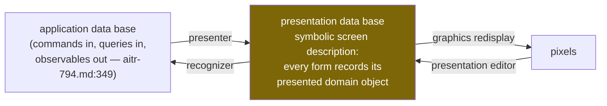
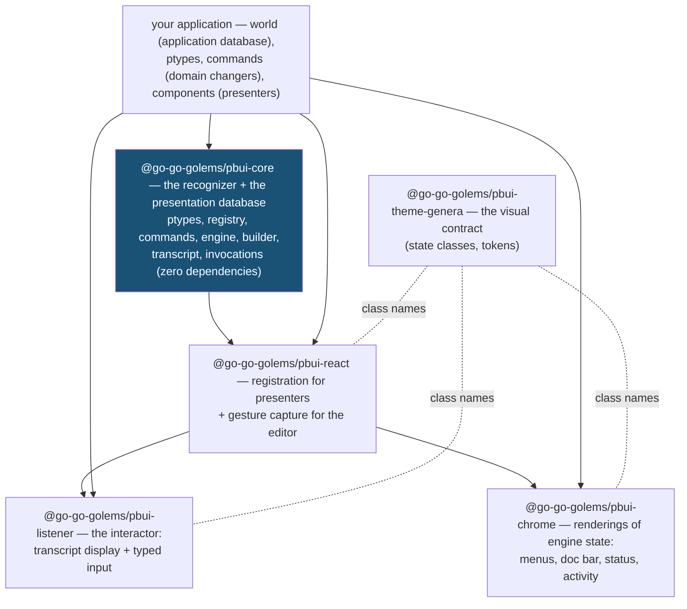

# The PBUI User Guide

This guide is a textbook for the PBUI framework. It has two parts. Part I explains the presentation-based interface model on its own terms — the model comes from Eugene Ciccarelli's 1984 MIT thesis (*Presentation Based User Interfaces*, AI-TR-794; a transcription lives in this repository, and this guide cites it by line as `aitr-794.md:NN`) and from its descendants, Symbolics Genera's Dynamic Windows and CLIM, the Common Lisp Interface Manager. Part II explains the framework: what each package and module is, which part of the model it implements, and how the parts interlock.

The order matters. The framework's programming interface is small, and nearly every question about it — why does a command receive already-looked-up objects? why is the right-click menu computed instead of written? why is there a registry when React already keeps a tree of the interface? — has the same kind of answer: because the model requires it. A reader who understands the model can extend the framework; a reader who only knows the function names can copy the demos.

This guide assumes you know React and TypeScript. It does not assume you know anything about presentation-based interfaces, Lisp machines, or the vocabulary that comes with them; every term of art is defined before it is used, starting in Chapter 2. If you have not built anything with the framework yet, read the Getting Started guide (`docs/getting-started.md`) first and come back; the concepts land better once you have seen the behavior. Keep the API reference (`docs/api-reference.md`) beside this guide for exact function signatures.

## Contents

**Part I — The model**
1. [The problem: meaning does not survive rendering](#1-the-problem)
2. [Vocabulary](#2-vocabulary)
3. [The primitive presentation system](#3-the-primitive-presentation-system)
4. [What a presentation is](#4-what-a-presentation-is)
5. [The presenter, decomposed](#5-the-presenter-decomposed)
6. [The recognizer, decomposed](#6-the-recognizer-decomposed)
7. [The coherence invariant](#7-the-coherence-invariant)
8. [From the thesis to CLIM to PBUI](#8-from-the-thesis-to-clim-to-pbui)

**Part II — The framework**
9. [The package map and the model-to-module map](#9-the-package-map)
10. [Anatomy of a gesture](#10-anatomy-of-a-gesture)
11. [The registry: the presentation database](#11-the-registry)
12. [References, resolution, and staleness](#12-references-resolution-and-staleness)
13. [Presentation types and coercions](#13-presentation-types-and-coercions)
14. [Commands and the accept loop](#14-commands-and-the-accept-loop)
15. [The typed builder](#15-the-typed-builder)
16. [Output records and the listener](#16-output-records-and-the-listener)
17. [Invocations and undo](#17-invocations-and-undo)
18. [Participation modes](#18-participation-modes)
19. [Keyboard and accessibility](#19-keyboard-and-accessibility)
20. [The performance model](#20-the-performance-model)
21. [Render media: HTML, SVG, canvas](#21-render-media)
22. [Testing your application](#22-testing-your-application)
23. [Extension points and deliberate omissions](#23-extension-points)
24. [Glossary](#24-glossary)

---

# Part I — The model

## 1. The problem

Consider a back-office application with an orders table. One cell shows "Bo Lindqvist" — a customer's name. In a conventional React application, that cell is a `<td>` element containing a string. The program *knew*, at the moment it rendered that cell, that this string stands for the customer whose id is `c-2`; the knowledge was right there in the `map` callback that produced the row. Then the JSX was emitted, and the knowledge was gone. The DOM node remembers the characters "Bo Lindqvist" and nothing else.

Now the application grows the behaviors users expect. Clicking the name should open the customer's record — someone writes an `onClick` handler on that cell. Right-clicking it should offer "Email customer" and "View orders" — someone writes a context-menu component and wires it to that cell. Later, a "reassign order" feature needs the user to pick a customer, and the natural interaction is "click any customer you can see" — so someone introduces a mode flag (`isPickingCustomer`), threads it through the props of every component that happens to render customer names, and teaches each one to behave differently while the flag is set. They miss two components. In one pane customers are now pickable; in another, clicking a customer during the reassign flow opens their record instead, destroying the half-finished reassignment.

The failure has a precise shape: **rendering discards the association between a form on the screen and the thing it stands for, so the association has to be re-attached by hand, at every place the thing is rendered.** Each re-attachment is written independently, so they drift apart. The same customer is clickable here, dead text there, and wrongly-behaved in a third place — not because anyone was careless, but because the architecture stores the association nowhere.

The presentation-based model keeps the association. Its founding definition is one sentence: a **presentation** is "a visible text or graphic form conveying information" (aitr-794.md:78) — and, critically, a presentation *records what it presents*. When "Bo Lindqvist" is a presentation, the interface knows — durably, queryably, at every moment after rendering — that this region of the screen stands for customer `c-2`, viewed as a customer. Every capability described in this guide is a consequence of retaining that one link past render time: menus that always offer the right actions, a pick-a-customer mode that automatically includes every customer on screen, documentation that appears when the pointer rests on anything, and a command history where the names of things remain clickable forever.

## 2. Vocabulary

The presentation-based tradition comes with words that this guide uses constantly. This chapter defines them once, in plain terms, so that later chapters can use them without stopping. Skim it now; return to it (or to the glossary in Chapter 24) whenever a term feels opaque.

**Domain object.** A thing your application is about: an order, a customer, a file, a task. Domain objects live in your application's state, not in the framework.

**Presentation.** A visible form on the screen that stands for a domain object, together with the recorded fact of what it stands for. The text "Bo Lindqvist" in the orders table is a presentation of customer `c-2`. The same customer can have many presentations at once — a table cell here, a mention in the output area there — and they are all equally "the customer" to the interface.

**Presentation type**, abbreviated **ptype**. A named category of presentation, such as `customer`, `order`, or `location`. The ptype answers "as *what* is this thing being shown?" — which matters because the same underlying object can be shown as different types (an order in a table row, and its status alone on a small badge), and because behavior attaches to types, not to individual presentations.

**Gesture.** Any single user action directed at a presentation: moving the pointer onto it (**hover**), clicking it, clicking it with the right mouse button (**right-click**, which by convention opens a menu), clicking with the middle button, or the keyboard equivalents of these. "Pointer" means the mouse cursor or its trackpad/touch equivalent.

**Command.** A named operation the user can invoke, with declared, typed **arguments** (also called parameters): *Assign Order* takes an order and a developer. Commands are the only way anything changes in a presentation-based application.

**Input context**, also called an **accept** (the noun). The state the interface enters when a command has been invoked but still needs an argument. The name comes from CLIM, where the function that asks the user for a typed value is called `accept`. While an input context is active, the interface is visibly "asking a question": *which DEV do you mean?*

**Eligible / inert.** During an input context, a presentation is *eligible* if it can answer the pending question (its type matches what the command wants) and *inert* if it cannot. Eligible presentations are highlighted with an animated dashed outline — this guide calls it the **marching-ants outline**, after the classic selection style — and inert ones are dimmed and unresponsive.

**Transcript** and **listener**. The transcript is the scrolling record of everything commands have printed — each entry is called an **output record** or a **line**. The listener is the on-screen component that displays the transcript and provides a typed input field below it. (The name "listener" is Lisp-machine heritage: the window that listens for your input.) The **prompt** is the text at the start of the input line showing what the system expects — either an idle marker like `SHOP>` or, during an input context, the pending question. **Scrollback** is the portion of the transcript that has scrolled out of view but can be scrolled back to.

**Echo.** When a command is invoked or an argument supplied, the system prints a bold line to the transcript restating what just happened (`Command: Assign Order (order) #1012`). This restatement is called echoing, and the fixed textual shape of these lines is the **echo grammar**.

**Chrome.** The parts of a window that are furniture rather than content: menus, title bars, status bars, borders. In this framework, "the chrome" specifically means the components in the `@go-go-golems/pbui-chrome` package — the context menu, the documentation bar, the status line, and pane frames.

**The documentation line** (or **doc line / doc bar**). A one-line strip, usually at the bottom of the screen, that continuously describes what the mouse buttons would do to whatever the pointer is currently over. It is a fixture of Genera's interfaces and of this framework.

**Hit-testing.** Determining which on-screen element a given screen coordinate belongs to — "what is at pixel (412, 88)?" The DOM does this for you when it delivers events to elements; a canvas does not, so canvas-based interfaces must hit-test explicitly.

**Engine.** In this framework, the object (`PbuiEngine`) that owns all interaction state and logic: the input context, gesture interpretation, menu computation, focus, and the transcript. When this guide says "the engine decides," it means code in `packages/core/src/engine.ts`.

**Registry.** The framework's store of all currently existing presentations — the modern implementation of what the thesis calls the presentation database. Chapter 11 is devoted to it.

**Stale.** A presentation is stale when the domain object it stands for no longer exists — it was deleted, or the data was replaced — but the presentation is still on screen (for example, in the transcript). Staleness is a normal condition with defined behavior, not an error.

**World.** This framework's name for the application's own state plus the functions commands use to change it. The engine treats the world as opaque; only your commands touch it.

## 3. The primitive presentation system

The thesis's primitive presentation system (PPS) is a model of any interface as two databases and three processes (aitr-794.md:80).



The **application database** is the domain — in this framework's terms, the world. The thesis characterizes it minimally: it accepts *commands* that change its state, accepts *queries*, and emits *observables*, meaning the query results (aitr-794.md:349). Nothing else about it matters to the interface, a stance the framework preserves: the engine never reaches into your world; it hands your world to your commands and stands back.

The **presentation database** is "the symbolic screen description containing presentations" (aitr-794.md:80). *Symbolic* is the operative word. This database does not hold pixels; it holds meaningful units — "a text string reading 'Bo Lindqvist', presenting customer c-2, located here" — and it can be queried the way any database can. It "contains the same information as the application data base, but … represented in a way that is directly viewable" and "is continuously displayed" (aitr-794.md:373), meaning the user never has to ask for the screen to be brought up to date.

The three processes connect them:

- The **presenter** builds and maintains the presentation database from the application database. "It creates the initial display and updates the display when the data base changes" (aitr-794.md:407). In modern terms: the render side.
- The **presentation editor** is the user's hands. "The editor allows the user to manipulate the forms on the screen … As these changes are made, their results are immediately visible" (aitr-794.md:375). Every gesture — clicking, dragging, typing — is presentation editing.
- The **recognizer** interprets what the user did, turning manipulations of presentations back into commands against the application database. The full model states this with care: "the recognizer translates editing *actions* into data base commands, rather than translating editing results into data base data" (aitr-794.md:405). The distinction matters: what the user *did* (clicked this presentation while that question was pending) carries meaning beyond what the screen ends up looking like afterwards. The same passage draws the conclusion that names the whole genre: "Therefore, the PPS model is also a direct manipulation interface."

One more process appears in the diagram: **graphics redisplay**, the mechanical business of keeping the pixels in agreement with the presentation database. The thesis deliberately keeps it outside the interesting part of the model and implements it with per-record timestamps and dirty-flag propagation — if a record has not changed, do not redraw it. A reader in 2026 will recognize this as a virtual DOM, forty years early. Hold that thought until Chapter 8, because graphics redisplay is the one process a modern framework supplies whole.

## 4. What a presentation is

The thesis develops a taxonomy of presentations that the framework inherits almost verbatim, so it is worth learning precisely. The running example in the thesis is PPSCalc, a spreadsheet.

**Name and composite presentations.** A *name presentation* is atomic — a single indivisible form, like the text "75" or a triangle glyph. A *composite presentation* "has graphical structure in which a larger presentation is constructed from smaller presentations. The composite presentation as a whole presents some domain information, and in addition some of its parts or properties present domain information as well. Generally, the hierarchical structuring of sub-presentations into a composite presentation follows a similar structure of the information in the data base" (aitr-794.md:657). An order row that presents the order, and contains within it a customer-name presentation and a status-badge presentation, is a composite: the structure of the picture follows the structure of the data. In the framework you build composites by nesting `<Presentation>` wrappers inside one another; Chapter 11 explains what happens when the user points at the nested region.

**Templates.** Not everything drawn on the screen presents something. The spreadsheet's grid lines, in the thesis's example, "serve a purpose in the overall presentation — [they make] the communication more effective — but [the grid] is not itself presenting anything in the data base. It is a kind of template, in which presentations are placed" (aitr-794.md:661). Table borders, pane frames, headings, and layout scaffolding are templates. The practical rule in the framework: render templates as plain JSX; wrap only the forms that stand for domain objects.

**Property and relation presentations.** Information can ride on *how* something is drawn, not only on *what* is drawn. "A relation between two presentations, such as nearness, alignment, or comparative size, can be chosen to convey information … A property of a presentation, such as its size, color, font, position, or direction, can similarly present information" — on a road map, a line presents a road while the line's *color* presents the class of road (aitr-794.md:673-675). The framework does not give these their own objects (a deliberate omission; Chapter 23), but the idea is used everywhere in the demos: a status badge's glyph color conveys the status class; a low-stock table row rendered in inverse video conveys a fact about the product.

**Presenting a property by presenting its value.** A subtle and important case. The text "75" in spreadsheet cell A2 is "generally not just a presentation of the number 75 … it is a presentation of a property of or fact about the A2 cell" (aitr-794.md:659) — namely, the fact that A2's value is 75. The same visible form can therefore legitimately be read as presenting different things, and *which* thing is a decision recorded in the presentation, not something recoverable from the pixels. This is one reason the ptype is an attribute of each individual presentation rather than of the domain object: an order shown in a table is a presentation of type `order`; the word "pending" on its badge is a presentation of type `order-status`, whose object is the status value.

**The presented-domain-object link.** In the thesis's implemented substrate, "all presentations have a property called presented domain object, which records the domain object being presented" (aitr-794.md:1517). This link — form to object — is the single most important piece of data in the entire model. The framework's version of it is the `ref` field of a presentation record, with one modernization explained in Chapter 12: it stores a *reference to* the object rather than the object itself.

**Reference resolution.** When the user points at a presentation and invokes something, which object did they mean? The thesis enumerates the cases with a diagram (aitr-794.md:1553-1565): sometimes the presentation's own presented object; sometimes *the value of the property* being presented (pointing at "75" to mean the number); sometimes *the enclosing composite's* presented object (pointing at a word inside a file's directory entry to mean the file). The framework answers the first case directly from the record, the second by giving the inner form its own presentation with its own type and object (the status badge presents the status value), and the third through nesting: a gesture that no inner presentation claims belongs to the enclosing one.

## 5. The presenter, decomposed

The thesis splits the presenter into three parts, classified "by the kind of knowledge the functions depend upon" (aitr-794.md:695-697). The split is the single most useful tool this guide can offer for organizing render code, because the three parts map onto three different kinds of code in a React application — and code becomes hard to change exactly when two of them fuse.

**The domain collector** "finds and interprets the relevant part of the data base … It is the part of the presenter that connects with the data base. Given the specification of what is to be selected, it constructs the needed queries" — and, pointedly, it "does not … know anything about the way such information will be presented" (aitr-794.md:713-715). In a PBUI application, the domain collector is your data-selection code: the `useStore(world.store)` subscription, the filter that narrows orders to the current view, the derived totals. It knows the shape of your state and nothing about pixels.

**The semantic presenter** "embodies the primary mapping from data base domain to visual domain, the kind of mapping specified by a map legend" (aitr-794.md:717). A map legend says: this line style means a highway; this color means this rainfall. The semantic presenter decides *which visual forms carry which facts*: this order becomes a table row; the customer's name appears as text wrapped in a customer presentation; the status appears as a badge. In the framework, this is the body of your component — the JSX and the `<Presentation>` wrappers.

**The organizational presenter** "imposes purely visual organization on the presentation … unlike the semantic presenter and the domain collector, [it] is domain-independent" (aitr-794.md:721). It knows about layout — alignment, spacing, avoiding clutter — and nothing about orders or customers. In the framework, this is your layout machinery: the `<Pane>` component, flexbox styles, the table element itself. Being domain-independent is what makes it reusable across applications.

The review heuristic that falls out: when a component resists change, look for fused parts. A component that filters the world *and* chooses visual forms *and* computes layout positions resists all three kinds of change at once. Keep the collector in hooks and selectors, the semantic mapping in the component body, and the organization in reusable containers, and each can vary independently — which is precisely the thesis's argument for the decomposition.

Notice, finally, what this chapter implies about the framework's size: **PBUI contains no presenter machinery at all.** All three presenter parts are ordinary React code that you write. The framework's sole demand on the render side is registration — telling the registry what each form presents — and that is one hook. The framework's real obligations begin where React's end: on the input side.

## 6. The recognizer, decomposed

The recognizer — the process that turns user actions back into commands — has a symmetric three-part split (aitr-794.md:741-747). Here the mapping runs onto *framework* modules rather than application code, which tells you where to look when input behaves unexpectedly.

**The organizational recognizer** "identifies the spatial relationships, presentations, and actions upon them that are relevant. It imposes a syntactic structure on these. Organizational recognition is generalized parsing" (aitr-794.md:743) — parsing generalized beyond text to shapes, positions, and actions. In the framework, this is everything that determines *which presentation a gesture addressed and what kind of gesture it was*: the DOM event handlers the hook attaches, the rule that the innermost nested presentation claims the pointer, the `registry.at(x, y)` query that hit-tests canvas coordinates, and the tokenizer that splits a typed command line into words.

**The semantic recognizer** "translates the syntactic structure into a semantic structure describing changes to the data base information" (aitr-794.md:745) — from "left-click on presentation P while question Q is pending" to "the user supplied P's object as the answer to Q." In the framework this is the engine's interpretation layer: the gesture router, the type-matching funnel (`coerceFor`), eligibility, menu computation, the ptype parsers, and the accept-loop state machine. All of Chapter 14 is about this layer.

**The domain changer** "translates this description of changes into the actual data base commands necessary to effect those changes" (aitr-794.md:747). In the framework, the domain changer is *your code*: the `run` body of each command is the only place in the entire system where the world changes. The engine never mutates your state; your state code never inspects engine internals. Commands are the seam between the two, and the `api` object a command receives is the entire width of that seam.

Two observations complete the picture. First, the framework implements a deliberate *subset* of the thesis's recognizer: gestures aimed at typed presentations, plus typed text — not free-form editing (nobody yet sketches a circle around three orders to group them; Chapter 23 discusses this frontier). Within the subset, the "editing actions, not editing results" principle survives intact: the same physical click means *supply an argument* during an input context and *run the default command* outside one, because the action's context is part of its meaning. Second, defending the domain-changer boundary is worth real effort: applications that mutate state outside commands lose undo, lose the history, and lose the transcript narration, all at once, because all three are built on the command seam.

## 7. The coherence invariant

The thesis binds the presenter and the recognizer together with a law, and the law is worth understanding because the framework enforces it with tests.

Define the *presenter function* P as the mapping from application-database states to presentation-database states — from data to screen. The thesis observes that P "must be invertible, so that the presentation data base conveys all the information" — a screen you cannot read back is not conveying — and that "the recognizer function is an extension of the presenter's inverse … for the convenience of the user: the user can create any of several variations on the form that the presenter would have chosen" (aitr-794.md:856). That extension has a name: **recognizer tolerance**. The presenter always emits one canonical form; the recognizer accepts a whole equivalence class of forms and treats them as meaning the same thing. The thesis's example: the presenter always left-aligns a formula in its cell, but the recognizer accepts the formula typed anywhere in the cell.

For the full model, let C be any atomic sequence of editing commands, and read `==` as "equivalent up to recognizer tolerance" (aitr-794.md:876-880):

```
C * P == P * R(C)
```

In words, from the thesis: "the editing commands C acting on a presentation data base created by the presenter P should result in the same presentation data base as would result from the presentation of the application data base that results from recognition of those editing commands" (aitr-794.md:880). Less formally: do something to the screen; let the system interpret it and redraw; the screen now shows what you made. When this equation holds, manipulation feels *direct* — your edit and the system's understanding of your edit coincide. When it fails, the interface feels haunted: you put something somewhere and the redraw moves it.

The framework encodes the invariant in two concrete places:

- **Per presentation type.** Every ptype can declare two functions: `print`, which produces the canonical text for an object (this is P restricted to text), and `parse`, which reads user-typed text back into an object (R restricted to text). The pair is called the type's **codec** — a coder/decoder pair, the term borrowed from data encoding. The tolerance contract is exactly the thesis's: everything `print` emits, `parse` must accept; `parse` should also accept reasonable variants (a prefix of the name, `1012` for `#1012`); and parsing normalizes to one canonical label. The repository holds this as an executable property: for generated objects `x`, `parse(print(x))` must recover `x`.
- **For the command loop as a whole.** The echo grammar — the exact text of the lines the engine prints when commands are invoked, arguments supplied, and aborts happen — is pinned by *golden tests*: tests that render scripted interactions to text and compare the result byte-for-byte against checked-in files. The transcript is the observable trace of the recognizer's behavior; freezing its text form is how the implementation keeps the invariant from quietly eroding during refactors.

## 8. From the thesis to CLIM to PBUI

Between 1984 and this framework lie two translations. Knowing which idea entered at which step explains several API shapes that otherwise look arbitrary.

**What CLIM added.** CLIM (the Common Lisp Interface Manager, the 1990s standardization of Genera's Dynamic Windows) made the input side systematic for *command-driven* applications — interfaces where the user's vocabulary is a set of named operations. Presentation types became a **lattice**: a hierarchy with subtyping, so that `milestone` can be declared a subtype of `task` and anything asking for a task accepts a milestone. Commands declared typed parameters. And the **input context** was born — though the thesis had already seen it coming. Describing its command-first control structure, where "the parameter descriptions have control of the selection, prompting the user with the parameter name and documentation, and checking that the argument selected is of the proper type," the thesis remarks: "it would be a relatively simple matter to tailor the mouse-tracking mechanism so that only presentations of the correct type would be sensitive to selection" (aitr-794.md:2067). That sentence *is* the accept loop: make the question visible by making only the possible answers respond. CLIM built it. The framework's marching-ants eligibility is its direct descendant. CLIM also contributed **translators** — rules mapping (gesture, presentation type, context) to commands, which is what makes right-click menus computed rather than written — and elevated **output records** to a central position: everything printed to the interactor stays sensitive, indefinitely.

**What the React translation required and what it paid back.** The required judgment: React's reconciler — the diffing machinery behind the virtual DOM — is a complete, superior implementation of the thesis's *graphics redisplay* process, and of nothing else. It keeps pixels in sync with a declarative description, exactly as the thesis's timestamp-and-dirty-subtree layer did. But the virtual DOM records elements and props — *how to draw* — and is deliberately opaque to semantic queries; it cannot answer "which regions of the screen present order #1012?" So the presentation database must be rebuilt as an explicit store (the registry), and the recognizer as an explicit engine. The dividend: because rendering *is* the presenter (Chapter 5), the framework needs no presenter machinery at all, and the whole of PBUI is the input half of the model plus one store.

The full correspondence, which Part II unpacks module by module:

| Model element | Thesis anchor | PBUI |
|---|---|---|
| application database | :349 | your world; `api.world` in commands |
| presentation database | :80, :1515-1517 | `PresentationRegistry` |
| presented-domain-object link | :1517 | `PresentationRecord.ref` + your `Resolver` |
| presenter (all three parts) | :407, :695-721 | your React components, plus registration via `usePresentation` |
| graphics redisplay | :689 region | React reconciliation — supplied, not rebuilt |
| presentation editor (gestures) | :375 | the hook's event handlers; keyboard bindings |
| recognizer (organizational + semantic) | :405, :741-745 | `PbuiEngine`: gesture routing, type matching, accept loop, command line |
| domain changer | :747 | your command `run` bodies |
| typed, sensitive argument selection | anticipated at :2067 | the input context: eligible/inert partition |
| command-first control structure | :2065 | `startCommand` with the invoking presentation pre-filling argument zero |
| command applications | thesis §5.1 | the invocation log; undo |
| output history | CLIM | transcript lines whose object mentions stay live |
| C·P == P·R(C) | :878 | ptype codecs + golden-tested echo grammar |

---

# Part II — The framework

## 9. The package map



Module by module, with the model element each implements and the other modules it touches:

| Module | Implements | Interrelations |
|---|---|---|
| `core/registry.ts` | the presentation database (Ch. 3, 11) | written by the React hook on mount/unmount; read by the engine for eligibility, menus, and focus; read by `byRef` for cross-view highlighting; notifies the hook when a presentation's appearance-relevant state changes |
| `core/ptype.ts` | presentation types and their codecs (Ch. 7, 13) | consulted by the engine's type-matching funnel, by typed input, by describe output, and by the documentation line |
| `core/command.ts`, `core/builder.ts` | command declarations — the domain-changer seam (Ch. 6, 14, 15) | tables feed menu computation and the command line; the builder wraps `run` bodies with reference resolution |
| `core/engine.ts` | the recognizer's semantic layer (Ch. 6, 10, 14) | routes gestures against registry records; owns the input context, coercions, menus, and keyboard focus; brackets every execution with an invocation record |
| `core/transcript.ts`, `core/transcript-text.ts` | output records and their canonical, golden-tested text form (Ch. 16) | written by `api.print`; displayed by the listener; object mentions re-enter the registry as presentations |
| `core/invocation.ts` | command applications (Ch. 17) | written by the engine around every execution; read by the activity pane, by the transcript's echo-line wrapping, and by Undo |
| `core/docline.ts` | the pointer documentation derivation (Ch. 19) | a pure function of engine state; rendered by the chrome's doc bar; doubles as the screen-reader narration |
| `react/use-presentation.ts` | registration plus gesture capture (Ch. 5, 10) | the only bridge between rendering and the engine |
| `listener/`, `chrome/` | the interactor and the window furniture | render engine, transcript, and invocation state; contain no interaction logic of their own |
| `theme-genera/` | the appearance of the model's states | a stylesheet over the class names the hook emits |

The dependency rules are the model's boundaries, enforced by the module graph. `core` imports nothing, because the recognizer must not know about rendering — that is what lets the same engine drive HTML, SVG, and canvas, and lets every interaction semantic be tested without a browser. `react` contains no interaction logic, because if it did, two different renderings of one engine could behave differently, and the engine could not tell. `listener` and `chrome` are replaceable renderings of state — swapping them cannot change what any gesture means. And your world never imports engine internals, because the domain changer's seam is the command `api`, and keeping it narrow is what keeps undo, history, and narration complete.

## 10. Anatomy of a gesture

Before the per-module chapters, follow one interaction end to end, because the modules only make sense as stations on this path. The situation: the user earlier right-clicked order **#1012** and chose **Assign Order …** from its menu. That command needs a second argument — a developer, ptype `dev` — so an input context is active: every developer name on screen shows the marching-ants outline, everything else is dimmed, the status line reads `Accept DEV`, and the prompt shows `Assign Order (order: #1012) (dev: a DEV) ⇒`. Now the user clicks the text "Ada" in a different pane.

```mermaid
sequenceDiagram
    participant DOM
    participant Hook as usePresentation
    participant Eng as PbuiEngine
    participant Reg as Registry
    participant Cmd as command run()
    participant Tr as Transcript

    DOM->>Hook: click event on <span>Ada</span>
    Hook->>Eng: gesture("click", record for Ada)
    Eng->>Eng: input context active → is Ada eligible?
    Note over Eng,Reg: O(1): the eligible set was computed once,<br/>when the context opened
    Eng->>Tr: echo "  dev (a DEV) ⇒ Ada"
    Eng->>Eng: advance → no arguments left → close the context
    Eng->>Reg: notify all presentations (their dimming/highlighting ends)
    Eng->>Cmd: resolve refs to live objects → run({order, dev}, api)
    Cmd->>Cmd: api.snapshotUndo(store); then mutate the world
    Cmd->>Tr: api.print(orderPart, " assigned to ", devPart, ".")
    Tr-->>Hook: new line renders → its object mentions register as presentations
    Reg-->>Hook: notified components re-render with fresh flags
```

Walk the stations. The **hook** did nothing but forward: it knew which record the click belonged to (its own) and passed the gesture to the engine. The **engine** consulted only two things — the current input context and the registry — and both the interpretation ("this click supplies the pending argument") and the bookkeeping (echo, closing the context) happened there. The **command body** received `order` and `dev` as live, typed domain objects — the engine looked them up from their references first — and touched nothing but the world. The **output** went through typed parts, so "Ada" in the transcript line is itself a presentation now, registered like any other; if a future command asks for a DEV, that transcript mention will grow marching ants too.

The system is a loop, and the registry is its hub: rendering writes into it, gestures are interpreted against it, and output feeds back into it.

## 11. The registry

The registry is the presentation database of Chapter 3, made executable. Every mounted presentation contributes exactly one record:

```ts
interface PresentationRecord {
  id: PresId;                 // assigned at registration, stable for the mount
  type: string;               // the ptype name: "order", "dev", "location"
  ref: ObjectRef;             // the presented-domain-object link (aitr-794.md:1517)
  label: string;              // the text used in echoes, menus, and the doc line
  paneId?: string;            // optional grouping, e.g. "listener"
  mode?: "gated" | "active" | "fallthrough";   // Chapter 18
  bounds?: () => Rect | null; // geometry, measured only on demand
}
```

You will rarely construct one of these yourself — the React hook does it on mount and removes it on unmount — but everything else in the framework consumes them, through three query families and two subscription channels:

- **`byRef(ref)`** returns every presentation of one domain object, wherever it appears. This powers the *related-hover* outline: rest the pointer on order #1012 in the orders table, and the mention of #1012 in the transcript and its row in a different pane all outline themselves at once. That behavior is the modern form of the thesis's requirement that multiple simultaneous presentations of one object stay consistent — the user should be able to *see* that these forms are the same thing.
- **`byType(type)`** returns every presentation of a given ptype; the engine uses it to build the eligible set when an input context opens, and the keyboard layer uses it for cycling.
- **`at(x, y)`** returns the smallest hit-testable presentation containing a screen point. DOM renderings never need it (the browser delivers events to elements), but canvas renderings do — Chapter 21.
- **`subscribe(fn)`** delivers registry events (a presentation was registered, updated, or removed); the engine listens so it can keep the eligible set correct while an input context is open.
- **`subscribePres(id, fn)`** is per-record: it wakes exactly one presentation component when *that record's* visual state may have changed. Chapter 20 explains why this channel exists.

**Nesting and the innermost-wins rule.** Composites (Chapter 4) appear in the framework as nested wrappers — a tag chip presentation inside an image card presentation. Both are records; both can be queried and menued. But a single pointer position must resolve to one of them, and the rule is *innermost wins*: the hook stops the propagation of pointer-movement events, so the deepest presentation under the pointer claims it. Hover the chip and the doc line describes the tag; hover the card's margin and it describes the image. A gesture no inner presentation claims belongs to the enclosing one — which is the thesis's parent-fallback resolution (aitr-794.md:1563-1565) recreated with the DOM's own event mechanics.

**Lazy geometry.** The `bounds` field is a function, not a rectangle. Measuring an element's position (`getBoundingClientRect`) forces the browser to compute layout, which is expensive in bulk; by storing a function, registration costs nothing and measurement happens only if someone actually hit-tests. Follow the same principle in your own code: never eagerly measure.

## 12. References, resolution, and staleness

The thesis records the presented domain object as a direct link — its databases lived "linked together into a single, uniform network" (aitr-794.md:82) in one Lisp heap, so a link could not dangle. A modern application has no such luxury. State is replaced immutably on every change; entities are deleted; data is refetched wholesale. A presentation that captured a direct object reference would silently go on showing — and worse, *acting on* — an object the application has already discarded.

The port therefore weakens the link to a **reference** and adds an explicit resolution step:

```ts
type ObjectRef =
  | { kind: string; id: string }        // entities: { kind: "order", id: "o-3" }
  | { kind: "value"; value: unknown };  // immediates — built with valueRef(x)

interface Resolver {
  resolve(ref: ObjectRef): unknown | undefined;   // undefined = the object is gone
}
```

You write the resolver once per application — typically a `switch` on `ref.kind` that looks the id up in your store. Everything in the framework that needs a live object (menus, describe output, argument predicates, command execution) calls it at the moment of need, never earlier. The consequences:

- **Presentations of deleted objects are harmless until used.** They render normally (their label is stored in the record), and fail *specifically* when someone tries to act through them.
- **Staleness has exactly one code path.** When a command is about to run, the framework resolves every entity argument first; if any resolves to `undefined`, the command is aborted with one standardized transcript message — `X no longer exists — presentation was stale; <Command> aborted.` — and your `run` body never executes. You do not write staleness checks. If you find yourself writing one, you have bypassed the builder (Chapter 15).
- **The transcript makes this non-optional.** Output lines keep references alive indefinitely (Chapter 16); a mention printed an hour ago must degrade gracefully rather than operate on dead state.

The second variant, **immediates**, exists because plain values are presentable too. A legend swatch that presents "load level 7" is the thesis's presenting-a-property-by-presenting-its-value (Chapter 4) with the value carried inline: `valueRef(7)`. Immediates resolve to themselves. They are compared with JavaScript `===` during duplicate-detection, so put only primitives in them.

## 13. Presentation types and coercions

A ptype names *a way of being on screen*. It is deliberately not the same thing as a domain class, for the reason established in Chapter 4: one `Order` object may appear under ptype `order` in a table and under ptype `order-status` on a badge, and a schematic diagram's `pin` is a ptype whose "objects" are grid positions. Ask "as what is this shown?", not "what class is this?".

Defining a type registers, in one place, everything the engine will ever need to do with that kind of presentation:

```ts
ptypes.define<Order>({
  name: "order",
  supertypes: [...],                     // lattice edges; "any" is the implicit top
  print: (o) => `#<ORDER #${o.number}>`, // object → canonical text
  parse: (text, world) => ...,           // user-typed text → object (tolerant)
  describe: (o, world) => [...],         // rich output for the Describe gesture
  defaultCommand: "Show Order",          // what a plain left-click runs
});
```

**The codec, spelled out.** `print` and `parse` are the two halves introduced in Chapter 7. `print` is what the system uses whenever it must name an object in text: in echo lines, in the documentation bar, in describe output. `parse` is what runs when the user *types* an argument instead of clicking one: during any input context, the prompt accepts text, and the pending type's `parse` decides whether that text names an object. If the user can ever refer to a type of thing by typing — and in a command-driven interface they always should be able to — the type needs both halves. The tolerance rules from Chapter 7 apply: accept prefixes and reasonable variants, normalize to one canonical label, and keep `parse(print(x)) ≡ x` as a test. One contract protects your printers: `print` is never called with `undefined` — the framework resolves the reference first, and if the object is gone it falls back to a generic `#<TYPE label>` form on its own.

**Subtypes: the is-a dimension.** The lattice expresses genuine specialization. Declaring `milestone` with `supertypes: ["task"]` means every question asking for a TASK also accepts a milestone, while a question asking specifically for a MILESTONE rejects plain tasks. The engine checks this with a walk up the declared supertype edges; `"any"` sits implicitly at the top and matches everything.

**Coercions: the can-stand-in-for dimension.** Some presentations can *answer for* a type they are not. In the schematic-editor demo, commands that place things ask for a LOCATION — a grid position. A `pin` presentation is not a location; it is a connection point on a component. But every pin *knows* its position, so the demo registers a coercion:

```ts
engine.defineCoercion({
  from: "pin",
  to: "location",
  coerce: (pinPres) => ({ type: "location", ref: valueRef(pinPos), label: "(120,80)" }),
});
```

Now, whenever a LOCATION is wanted, pins light up alongside the bare canvas: clicking a pin supplies the pin's snapped position. Subtype checks and coercions are consulted by one funnel — `coerceFor(spec, presentation)`, which tries the lattice walk first and the coercion list second — and because *eligibility* flows through the same funnel, the highlighting automatically reflects both mechanisms. The design rule for choosing between them is semantic, not technical: a milestone *is* a task, so it is a subtype; a pin *is not* a location, it merely knows one, so it is a coercion.

## 14. Commands and the accept loop

This chapter is the center of the framework. Read it slowly.

A command is a declaration, not a handler. It states a name, typed arguments, an applicability condition, and a body:

```ts
{
  name: "Assign Order",
  args: [ { name: "order", type: "order" }, { name: "dev", type: "dev" } ],
  appliesTo: (order) => order.status === "pending",   // when menus offer it
  run: (args, api) => { ... },                        // the domain changer
}
```

Everything else in this chapter is machinery the engine derives from such declarations.

**The state machine.** The engine holds at most one *input context* at a time — a value `AcceptState = {cmd, values, spec}` where `values` are the arguments collected so far and `spec` is the one currently wanted — and four operations move it:

```
startCommand(cmd, seed?)   Print the echo line "Command: <name>". If the command
                           was chosen from a presentation's menu, that presentation
                           pre-fills the first argument (the "seeded start").
                           Then advance.

advance(cmd, values)       Find the first argument not yet in `values`.
                           If there is none: close the context and execute.
                           Otherwise: open the context asking for it.

supply-a-value             Three doors into the same room:
                           · clicking an eligible presentation,
                           · typing text that the pending type's parse accepts,
                           · choosing from a menu, for menu-valued arguments.
                           Each validates, echoes "  <arg> (a TYPE) ⇒ <label>",
                           and calls advance again.

abort()                    Escape (or right-click). Prints "[Abort]".
```

**The seeded start deserves a name and a habit.** When the user right-clicks order #1012 and picks *Assign Order …* from its menu, the order they clicked becomes the first argument automatically — the echo reads `Command: Assign Order (order) #1012` and the context opens directly on the *second* argument. This is the thesis's command-first control structure (aitr-794.md:2065) fused with menu invocation: multi-argument commands read as "verb *this*, with …". Design your argument orders so the most menu-natural object comes first.

**Eligibility is computed before the click, and that is a promise.** A presentation is eligible when the type funnel succeeds (`coerceFor`, Chapter 13) *and* every declared restriction passes: the argument's `where` predicate, its `distinct` flag (the value must differ from arguments already collected — *Compare Sites* cannot receive the same site twice), and its `validate` function. Because all of this runs when the context opens rather than when the click lands, the marching-ants outline never advertises a supply that would then be rejected — the highlight is truthful. And because the predicates receive the arguments already collected, constraints that span arguments cost one line: in the gallery demo, *Untag Image* wants a TAG, but only the tags *the already-chosen image carries* light up, via `where: (tag, soFar) => soFar.image.tags.includes(tag.name)`.

**Menus are a derivation, not a data structure.** A presentation's right-click menu is computed on the spot: every command whose *first* argument this presentation could fill (through the same type funnel), filtered by `appliesTo` evaluated on the resolved object. This is why menus in the demos are state-sensitive with no menu code anywhere: a pending order's menu offers *Mark Paid* and *Cancel*; after payment, the same right-click offers *Fulfill* and *Refund* — the predicates changed their answers, nothing else happened.

**The other derivations.** The prompt line renders the collected-so-far and the pending question (`Assign Order (order: #1012) (dev: a DEV) ⇒`). The documentation bar explains the current possibility ("Accepting a DEV — Mouse-L on a highlighted presentation supplies it or type it at the prompt. [Escape] aborts."). The status line shows the mode (`Accept DEV`). All are pure functions of the same `AcceptState` — which is the discipline to imitate: if you find yourself wiring context-dependent UI by hand, derive it instead, or it will eventually disagree with the engine.

**The typed command line is the same machinery once more.** At an idle prompt, `assign order 1012 ada` matches the command name by longest prefix, then feeds the remaining words through the same parsers and validators, positionally, as if each had been typed at its own prompt. One state machine, one echo grammar, three input styles — and the grammar is pinned by the golden tests of Chapter 7, so it behaves like a versioned format.

Two smaller facilities complete the loop. `api.accept(spec)` lets a command body ask for *another* value mid-execution, as a promise — useful when the number of arguments is not fixed. And `api.invoke(name, preset)` starts another command from inside one: the schematic editor's *Draw Wire* re-invokes itself with the just-finished endpoint as the next starting point, so wires chain until the user presses Escape.

## 15. The typed builder

Chapter 14 described commands in their runtime form, where `run` receives raw collected values — references and labels — and the body must look objects up, guard against staleness, and unwrap immediates before doing anything. That form works and remains supported, but it makes every command body start with the same ceremony. The **builder** is the authoring layer that removes the ceremony by exploiting information the declaration already contains:

```ts
const c = commandBuilder(commands);
c.define({
  name: "Assign Order",
  args: {
    order: arg.presentation<Order>("order"),
    dev:   arg.presentation<Dev>("dev"),
  },
  appliesTo: (order: Order) => order.status === "pending",
  run: ({ order, dev }, api) => {
    api.snapshotUndo(world.store);
    // order is an Order and dev is a Dev — live objects, never stale here
  },
});
```

Three mechanisms make this work, and they are worth knowing because they explain the builder's few constraints:

- **Descriptors carry types.** `arg.presentation<Order>("order")` produces a small descriptor object that remembers, in its TypeScript type, what a resolved value will be. (The technique — a type parameter recorded on a field that never holds a runtime value — is called a *phantom type*.)
- **The argument object's shape becomes `run`'s parameter type.** TypeScript can transform one object type into another (a *mapped type*); the builder maps "object of descriptors" to "object of resolved values," which is how `{ order, dev }` arrives fully typed. This is also why **the keys of the `args` object are meaningful twice**: their *insertion order* is the order arguments are collected in, and the key text itself appears in prompts and echoes (`(dev: a DEV) ⇒`). Name keys for the user, and treat renaming one as a user-visible change.
- **Resolve-then-run.** The builder wraps your body: before it runs, every entity reference is resolved through your resolver, every immediate is unwrapped, and any stale entity aborts the whole command with the standardized message from Chapter 12. Your body sees domain objects or does not run at all.

Conventions that keep builder code healthy:

- Put `api.snapshotUndo(store)` *after* any guard clause that might refuse the command and *before* the first mutation — it captures the store at the moment it is called (Chapter 17), and a refused command should not register an undo step that does nothing.
- Annotate the `soFar` parameter in predicates — `where: (p: Product, soFar: { order?: Order }) => …`. It cannot be inferred, for a structural reason: the descriptors are constructed *inside* the object literal that defines the argument set, so the set's type does not exist yet when each descriptor is typed. The candidate value's type is inferred; the already-collected values need your annotation.
- Prefer the argument sugar — `arg.number({ min: 1, max: 99, integer: true })`, `arg.text()`, `arg.choice<T>({ options })` — over hand-written `validate` functions, except where a test or a UX requirement pins an exact error message; then a custom `validate` returning exactly that string is the right tool.

## 16. Output records and the listener

CLIM's deepest idea is easy to state and easy to underestimate: *the interactor's history is made of the same material as the rest of the interface.* When a command narrates its effect, the objects it mentions should not decay into inert text — they should remain presentations.

The framework's transcript lines are arrays of typed **parts**:

```ts
type OutputPart =
  | { t: "text"; s: string }     // plain text
  | { t: "bold"; s: string }     // emphasis (echo lines use it)
  | { t: "err";  s: string }     // error styling
  | { t: "pres"; type: string; ref: ObjectRef; label: string };  // a live mention
```

Commands print through their api, mixing strings with parts:

```ts
api.print(orderPart(order), " assigned to ", devPart(dev), ".");
```

where `orderPart` is a one-line helper you write per entity type, returning the `pres` part for an order. When the listener renders that line, the `pres` part mounts a real `<Presentation>` — same wrapper, same hook, same registration — so the mention is an ordinary registry record with everything that implies: it shows the doc line on hover, opens the order's menu on right-click, runs *Show Order* on click, and participates in eligibility. That last one closes a satisfying loop: if a command is currently asking for an ORDER, a mention printed by an *earlier* command grows marching ants and can be clicked to answer — and because the eligible set updates as registrations arrive, even output printed *during* the current context becomes supplyable the moment it appears.

Because parts carry references (Chapter 12), mentions survive domain churn and degrade explicitly when their object is deleted, rather than acting on dead state.

Three disciplines keep transcripts useful:

- **Write the part helpers on day one.** The moment narration goes through plain strings, the transcript stops being an interaction surface, and retrofitting parts into every `print` call later is tedious.
- **Narrate effects, not intentions.** The echo lines already record what was asked (Chapter 14); a command's own output should state what *changed*, with the changed objects as parts.
- **The transcript is a view, not storage.** It is capped (oldest lines drop off), and dropped lines unregister their presentations. Durable history is the invocation log — next chapter.

The listener component itself renders the records, the morphing prompt (idle command line ↔ typed-argument input ↔ a hint to point when the pending argument is supplied by clicking), Tab completion of command names, an input history recalled with the Up and Down arrow keys — and it wraps each command's echo line in a presentation of that command's *invocation*, which is the doorway to undo.

## 17. Invocations and undo

The thesis's implemented substrate reified what it called *command applications*: each act of running a command became an object with lifecycle state — pending, executing, completed — that could itself be presented and manipulated. The framework's `InvocationLog` is that mechanism. Around every execution, the engine records an invocation:

```ts
interface CommandInvocation {
  id: string;
  name: string;               // "Assign Order"
  argValues: ArgValues;       // the collected arguments, as references
  status: "executing" | "completed" | "failed" | "undone";
  undo?: () => void | Promise<void>;   // present iff the command opted in
  seq: number;                // ordering; the core keeps no clock
  echoLineId?: string;        // which transcript line echoed this invocation
}
```

Calling `installUndoCommands(engine)` completes the circle: it registers an `invocation` ptype (so invocations can be described and menued like anything else), a global **Undo** command, and a per-invocation **Undo Invocation**. The `ActivityPane` chrome component then shows the log as a list of live invocation presentations with status glyphs, and — because the listener wraps echo lines in invocation presentations — *right-clicking a past command in the transcript offers to undo it*. Command history is made of presentations. This is the same move as Chapter 16, applied to the system's own actions.

Undo itself is opt-in per command, with two flavors and one deliberate restriction:

- **Snapshot undo** — `api.snapshotUndo(store)` — records the store's current state object. Because your store is updated immutably (state replaced, never mutated in place), the old state object still exists and shares structure with the new one; keeping it costs almost nothing, and restoring it is exact. The caveat is scope: undo puts back the *entire* store, including changes that happened after the command for unrelated reasons — a background simulation tick, for instance. In worlds with live ticking, prefer the second flavor for anything tick-adjacent.
- **Explicit inverse** — `api.undoable(capture)` — runs `capture()` immediately and keeps the function it returns as the inverse. Use it when "undo" is not "restore the world": anything with effects that a snapshot cannot represent.
- **Linearity.** Only the *most recent* undoable invocation can be undone; asking to undo an older one is refused with a message naming what must be undone first. This is a considered restriction, not a limitation to apologize for: undoing something out of order requires knowing whether later commands depended on it, and that dependency analysis is a research problem the demo corpus never justified. Unwinding several steps is `undo`, `undo`, `undo`.

What should *not* opt in: commands whose effects leave the process (sending an email — there is no inverse), and pure navigation (switching tabs) — these are still recorded as history, they simply carry no `undo`.

## 18. Participation modes

Taken literally, the accept loop of Chapter 14 is modal: while a question is pending, every click that does not answer it is swallowed. The dimming and swallowing are mostly *right* — they are how the user sees the question — but two structural exceptions turned up the moment real applications were built on the framework, and both are worth understanding because they teach where the model bends.

The first: **navigation must survive questions.** In the e-commerce demo, *New Order* asks for a CUSTOMER. If the customer you want is listed on a different tab, a modal context traps you: the tabs are presentations too, they do not match CUSTOMER, so clicking them does nothing, and your only way out is to abort and start over. The second: **input surfaces must be reachable through decoration.** In the schematic editor, placing a component asks for a LOCATION, supplied by clicking the drawing canvas — but the canvas is covered with component presentations, each of which swallows the click that was meant for the canvas underneath it.

The resolution is a per-presentation **participation mode**, governing how a presentation behaves during a *foreign* input context (one whose pending type it does not match):

| Mode | During a foreign accept | Grant it to |
|---|---|---|
| `gated` (the default) | dimmed; gestures swallowed | nearly everything — the visible partition is the feature |
| `active` | fully interactive; a left-click runs the presentation's default command, *provided* that command is declared safe to run mid-context; the pending question survives | navigation: tabs, view switchers |
| `fallthrough` | transparent to gestures; events pass to whatever is underneath | decoration lying over input surfaces |

Soundness rests on one rule, enforced when commands are defined: a command declared `duringAccept: true` (safe to run mid-context) must be **seed-complete** — executable from the invoking presentation alone, needing no further arguments — because a command that opened its *own* input context would stack a question on a question, and the framework's invariant is one input context at a time. Attempting to declare a violating command throws immediately, with a message citing the rule.

Two details complete the semantics. After an `active` command runs, the engine recomputes the eligible set — the command's effects may matter, and in the flagship case they do: switching tabs mounts a new pane full of presentations, and recomputation is exactly what lets the user answer the pending CUSTOMER question *from the tab they just opened*. And `fallthrough` needs no engine logic at all: it is the CSS declaration `pointer-events: none` without the dimming, letting the browser deliver the click to the canvas natively. In every mode, *eligible* presentations behave normally — modes only govern the non-matching case.

## 19. Keyboard and accessibility

Genera's screens carried a fixture this framework preserves: the **pointer documentation line**, a strip at the bottom of the screen continuously stating what the mouse buttons would do to whatever the pointer is over. Chapter 14 established that the doc line is a pure derivation of the engine's state. The port's accessibility strategy begins with an observation about that fact: *narration for assistive technology is the same derivation.* The doc bar is marked as a **live region** — an area whose text changes are announced by screen readers (`aria-live="polite"`, where "polite" means the announcement waits for a pause rather than interrupting). So when the interface enters an input context and the bar reads "Accepting a DEV — Mouse-L on a highlighted presentation supplies it," a screen-reader user hears the same sentence a sighted user reads. No second set of strings exists to fall out of date.

The keyboard is then bound as a *second body for the same gestures*, not a parallel feature set:

- The engine keeps a **focus cursor** — the keyboard's equivalent of the pointer position — and the doc line treats the focused presentation exactly as it treats a hovered one.
- One Tab stop reaches the presentation layer (a **roving tabindex**: rather than making every one of a thousand presentations its own Tab stop, exactly one carries `tabIndex=0` at a time, and arrow keys move the cursor among them; the browser's real focus follows the cursor so the accessibility tree stays truthful).
- On a focused presentation, Enter or Space *is* the click gesture, `m` (or Shift+F10) opens the menu — itself a proper ARIA menu with arrow-key movement and type-ahead (typing the first letters jumps to the matching item) — and `d` runs Describe.
- During an input context, **Tab cycles through the eligible presentations only**. This is the piece that makes the accept loop fully operable without a pointer: the question is visible, and Tab walks its possible answers.

Your obligations as an application author are small but real: give presentations meaningful `label`s (the label is what gets announced and echoed), and do not attach competing key handlers or `tabIndex` attributes inside presentations.

## 20. The performance model

The thesis's redisplay diffed the entire presentation database on every update, which was fine at 1984 screen densities. In React, the unit of cost is the *component re-render* — running a component's function again to see if its output changed — and a framework that makes every presentation a subscriber must say precisely who re-renders when. A naive implementation (every presentation subscribes to all engine state) re-renders every presentation on every pointer movement; at 2,000 presentations that is 2,000 re-renders per mouse twitch, and the interface melts.

The framework's answer splits invalidation by *event frequency*:

- **Hover is pointer-paced and targeted.** When the hover moves from presentation A to presentation B, the engine notifies exactly: A, B, and the presentations of the same objects as A and B (their related-hover outlines change too — found through the registry's `byRef` index). Everything else is untouched. Measured on the repository's benchmark page: about **2 component re-renders per hover transition with 2,000 presentations mounted**.
- **Input-context transitions are human-paced and broadcast.** Opening or closing an accept legitimately changes every presentation's appearance (each is now eligible, inert, or unaffected), so the engine recomputes the eligible set once — a single pass over the registry applying the Chapter 14 predicates — and notifies everyone. After that pass, each presentation's "am I eligible?" check is a constant-time set-membership lookup.

Consequences for your code:

- The `where` and `validate` predicates you write run **for every candidate presentation, every time a context opens**. Keep them cheap, synchronous, and free of side effects. Filtering a small array is fine; sorting the world is not.
- Components that reflect *any* engine change — doc bars, status lines — may use the broad `useEngineState()` subscription, because there are only a few of them. Anything that exists *per presentation* must go through `usePresentation` (which subscribes narrowly) or `registry.subscribePres`.
- The repository enforces the ~2-renders-per-hover budget in continuous integration (`#bench` route, `@perf` test). If you modify anything on the pointer path, run it: `pnpm exec playwright test --project=perf` in `apps/demos`.

## 21. Render media

The thesis walls graphics redisplay off from the model precisely so that presentations are not married to one drawing substrate. The framework honors the wall: the registry, the engine, and every semantic in Chapters 11–19 are medium-independent, and only two things vary per medium — how gestures are captured, and how the state flags are made visible.

- **HTML** is the default: `<Presentation>` renders a span or div, the browser delivers events to it, and the theme's state classes draw outlines.
- **SVG** needs two substitutions: `<SvgPresentation>` wraps content in a `<g>` element with an explicit invisible `hitRect` (SVG shapes are only clickable where they are painted, so a thin line needs a padded rectangle to be comfortably targetable), and highlights are drawn as ring rectangles because CSS outlines do not apply inside SVG. Nesting works as in HTML — the schematic demo layers pin presentations on top of component presentations.
- **Canvas** has no elements at all, so both substitutions become explicit: the renderer registers records whose `bounds` thunks report where things were drawn this frame, pointer events on the single canvas element are answered by `registry.at(x, y)` — the registry's hit-test — and the renderer paints hover and eligibility affordances itself by reading the same flags. Above the registry, nothing changes: menus, accepts, the doc line, and the transcript are identical across all three media.

## 22. Testing your application

The repository's own verification stack mirrors the model's layers, and each layer catches a class of mistake the others cannot see. Reproduce the stack for your application:

1. **Engine-level tests, no browser.** Construct the engine with your real ptypes and commands, drive it directly — `startCommand`, `gesture` with hand-built records, `submitTyped` — and assert on `renderTranscript(engine.transcript.lines())`, the canonical text form. This pins the behavior of your recognizer cheaply and fast. One hard-won rule: make fixture printers and parsers exactly as strict as production ones; a fixture that defensively tolerated `undefined` once concealed a genuine contract violation until a browser found it.
2. **Codec property tests.** For every ptype with both halves: `parse(print(x))` recovers `x` for generated objects, and each tolerated variant normalizes to the canonical label. This is Chapter 7's invariant running in CI.
3. **Component tests** for anything you build directly on the hook: assert gesture routing, state-class application, and registration that survives React's StrictMode double-mounting.
4. **End-to-end tests** for whole flows, in a real browser, against a *production build* — the development server's hot-module reloading remounts elements mid-interaction and will make the suite flaky. Two selector rules from experience: after navigating by URL hash, reload (same-document navigation does not remount the application); and match menu items by their exact text, because item labels are prefixes of one another more often than you expect.

## 23. Extension points

Three mechanisms from the thesis are deliberately absent from the framework. Each has a designed landing pad — a place the architecture already prepared — and if your application needs one, extend along the pad rather than around it.

**Structural recognizers.** The thesis's organizational recognizer parsed *arrangements and actions*: a line sketched through a presentation as a deletion command, an annotation written next to a listing as an edit. This requires spatial queries over the presentation database (which the registry has) plus a log of editing actions over time (which nothing yet keeps). **Planned databases.** The thesis describes interfaces where the user edits a *proposed* future state and then issues one "do it"; the mechanism maps onto a second store instance presented through the same machinery, plus the invocation log to carry the plan — snapshot undo is this mechanism's first fragment. **Presentation styles as data.** The thesis attached named, swappable rendering styles to classes, resolved most-specific-first, so "show this as an icon / as a row / as a phrase" was runtime data; the framework approximates this with ordinary component composition, and making it first-class would mean a presenter registry keyed by ptype and style name. Before building any of these, read the two design documents in `ttmp/` (CLIM-JSX-004 and 005) — they record why the current boundaries sit where they do.

## 24. Glossary

| Term | Meaning | Where defined |
|---|---|---|
| presentation | a visible form recorded as standing for a domain object under a ptype | Ch. 1, 2; aitr-794.md:78 |
| domain object / world | a thing the application is about / the application's state plus its mutation functions | Ch. 2 |
| ptype | a named way of being on screen; carries codec, describe, default command | Ch. 2, 13 |
| presentation database / registry | the symbolic, queryable record of what is on screen | Ch. 3, 11; aitr-794.md:80 |
| presented domain object / `ref` | the form-to-object link every presentation carries | Ch. 4, 12; aitr-794.md:1517 |
| presenter / recognizer | derives the screen from the domain / interprets user actions as commands | Ch. 5, 6 |
| domain collector, semantic presenter, organizational presenter | the presenter's three knowledge-separated parts | Ch. 5 |
| organizational recognizer, semantic recognizer, domain changer | the recognizer's three parts; the last is your command bodies | Ch. 6 |
| codec (`print`/`parse`) | a ptype's canonical text output and tolerant text input | Ch. 7, 13 |
| recognizer tolerance | the parser accepts an equivalence class; the printer emits one canonical form | Ch. 7 |
| C·P == P·R(C) | the direct-manipulation coherence invariant | Ch. 7; aitr-794.md:878 |
| composite / template | a structured presentation whose parts also present / drawn scaffolding that presents nothing | Ch. 4 |
| gesture / hover / hit-testing | one user action on a presentation / pointer resting on it / finding what is at a coordinate | Ch. 2 |
| command / argument / seeded start | a declared operation / its typed parameter / menu-invoked commands pre-filling argument zero | Ch. 2, 14 |
| input context, accept | the state of a command collecting a typed argument | Ch. 2, 14; anticipated at aitr-794.md:2067 |
| eligible / inert / marching ants | can answer the pending question / cannot / the animated dashed outline on the former | Ch. 2, 14 |
| coercion | a can-stand-in-for conversion consulted during type matching | Ch. 13 |
| transcript / listener / prompt / echo / scrollback | the printed history / its display component / the input line's leading text / the restatement of invocations / lines scrolled out of view | Ch. 2, 16 |
| output record / part | one transcript line / its typed fragments; `pres` parts stay live | Ch. 16 |
| invocation | the record of one command execution; the unit of history and undo | Ch. 17 |
| snapshot undo / explicit inverse / linearity | restore a remembered store state / run a captured inverse function / only the newest undoable can be undone | Ch. 17 |
| participation mode (gated / active / fallthrough) | behavior during a foreign input context | Ch. 18 |
| doc line / live region | the continuous gesture documentation strip / a region whose changes screen readers announce | Ch. 2, 19 |
| focus cursor / roving tabindex | the keyboard's pointer / one movable Tab stop for the whole layer | Ch. 19 |
| stale | the presented object no longer exists; defined, handled centrally | Ch. 2, 12 |
| echo grammar / golden test | the transcript's canonical text form / a test comparing output byte-for-byte against a checked-in file | Ch. 2, 7 |
| chrome | menus, bars, frames — window furniture; the `@go-go-golems/pbui-chrome` package | Ch. 2 |
| engine | `PbuiEngine`: the recognizer's implementation and the owner of interaction state | Ch. 2, 9 |
